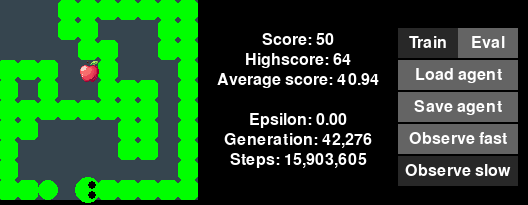

# Snake game with Deep Q-learning agent

This project contains a Snake implementation along with a reinforcement learning agent that learns to play the game autonomously using Deep Q-learning.

## Agent implementation details
- Experience replay and batch training to make the training more efficient.
- Separate target network for more stable Q-value target estimation.
- Double DQN to reduce the overestimation of Q-values.

- The network consists of 2 convolutional layers followed by 3 fully connected layers.
- The state representation consists of 4 channels representing the snake's head, body, tail, and the food position. A direction vector is added in the first fully connected layer. 
- Outputs 3 Q-values corresponding to turning left, right or moving straight.

## UI

## Requirements

- Python 3.11
- PyTorch 2.13.0
- Pygame 2.6.1

## How to run
With python 3.11 run the agent_main.py file to train, load and observe the agent play.